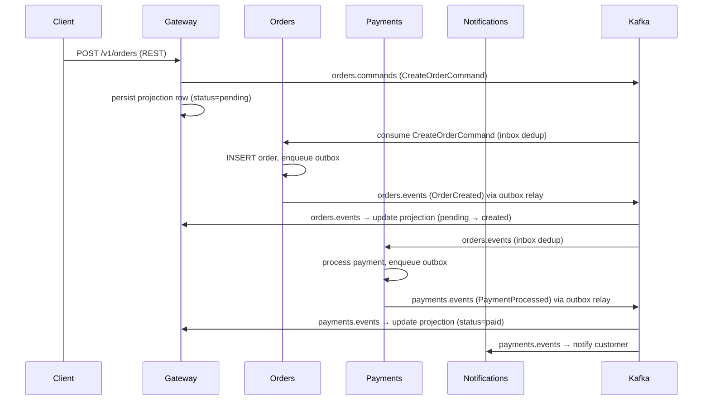

# go-boilerplate

> **Contributing / local setup:** See [CONTRIBUTING.md](CONTRIBUTING.md). Run `just hooks` once after cloning to install pre-commit (fmt + lint + build) and pre-push (test -short) git hooks via lefthook.

A **production-grade, opinionated Go microservice boilerplate** for highload / enterprise teams. The repo is split into two zones: `platform/` is the reusable starter kit — config, structured logging, OTel observability, CQRS typed-decorator pipeline, the `servicekit` wiring harness, Kafka outbox/inbox + typed consumers, two-tier cache, blob storage, resilience, auth/authz, audit, feature flags, and graceful lifecycle management — all with zero business logic. `examples/` contains four deletable demonstration services (gateway, orders, payments, notifications) that show how to wire the platform together; remove `examples/`, `proto/`, and `gen/` to get a clean blank canvas. The local stack runs via `just up` / `just up-full` (`docker compose` with profiles): Postgres, Redpanda (Kafka + Schema Registry), Redis, SeaweedFS, Keycloak (core), plus OTel Collector, Jaeger, Prometheus, Grafana, Pyroscope (observability profile), and the four app services (apps profile).

---

## Stack

| Concern | Choice |
|---|---|
| Go version | 1.26 |
| Container CPU sizing | **`go.uber.org/automaxprocs`** blank-imported in `servicekit.Main` (single entry point for every service binary) on top of Go 1.25+ native cgroup awareness |
| HTTP edge | `net/http` 1.22 routing + chi + oapi-codegen v2 |
| Kafka client | **franz-go** (pure-Go, EOS-capable, cooperative-sticky) |
| Event contracts | **protobuf + buf + Schema Registry** (typed, compat-enforced; SR wire format opt-in via `SERDE_SR_URL`, franz-go `pkg/sr`) |
| Database driver | **pgx v5 + pgxpool** (tuned) + PgBouncer (transaction mode) |
| Query codegen | **sqlc** (CopyFrom / SendBatch for throughput) |
| Migrations | **goose** (embedded SQL + Go) |
| Config | **caarlos0/env v11** (struct-tag, zero reflection overhead) |
| Logging | **`log/slog`** API + **zap** backend via `zapslog` |
| L1 cache | **otter v2** (W-TinyLFU, loading cache) |
| L2 cache | **rueidis** + Redis pub/sub cross-instance L1 invalidation + circuit breaker on L2 |
| Object storage | **aws-sdk-go-v2 S3** behind `ObjectStore` interface; **SeaweedFS** for local dev (MinIO OSS archived — ADR-0012) |
| Resilience | **failsafe-go** (Retry/CB/Timeout/Bulkhead/RateLimit) |
| Observability | **OpenTelemetry** → OTel Collector → Jaeger + Prometheus; **Pyroscope** continuous profiling (`PYROSCOPE_ADDR` opt-in SDK) |
| Auth | **Keycloak** OIDC + **lestrrat jwx/v3** JWKS validation (clock skew + azp options) |
| AuthZ | RBAC behavior (roles/perms from token claims) + resource-aware ownership checks |
| Feature flags | **OpenFeature** Go SDK v2 (`go.openfeature.dev/openfeature/v2`) + swappable provider |
| Reliable publish | **transactional outbox** + polling relay (DB→Kafka) |
| Idempotent consume | **inbox table** dedup (`ProcessOnce`) |
| CQRS | **typed generic decorators** (`platform/cqrs`) |
| DI | **manual constructor wiring** + `run.Closer` reverse-order teardown |
| Testing | **testify + testcontainers-go** + `uber-go/goleak` |
| Dev tooling | **just** + golangci-lint + buf + sqlc + air |

---

## Architecture — event choreography



All domain state transitions are driven by Kafka events. The gateway owns a **read-model** (projection) updated by consuming events; REST queries are served from this projection — no sync RPC between services.

---

## Quickstart

**Prerequisites:** Docker, Go 1.26+, [just](https://just.systems/).

### Compose profiles

The stack is split into three profiles so you only run what you need:

| Profile | Services started | Command |
|---|---|---|
| _(none — core)_ | postgres, redpanda, redpanda-console, redis, seaweedfs, seaweedfs-setup, keycloak | `just up` |
| `observability` | core + otel-collector, jaeger, prometheus, grafana, pyroscope | `just up-obs` |
| `apps` | core + gateway, orders, payments, notifications | `just up-apps` |
| both | Everything | `just up-full` |

```bash
# Start everything (core infra + observability + apps)
just up-full

# Or: start just core infra for local development (run services via go run)
just up

# Stop everything and remove volumes
just down
```

```bash
# Create an order (auth disabled by default). Returns 202 + Location header
# + order_id; an immediate GET returns 200 {status:"pending"} — not 404.
curl -s -XPOST localhost:8080/v1/orders \
  -H 'Content-Type: application/json' \
  -d '{"customer_id":"c1","amount_cents":1500,"currency":"USD"}' | jq .

# Retry-safe create: the same Idempotency-Key always maps to the same order
# id (UUIDv5), so client retries never duplicate orders.
curl -s -XPOST localhost:8080/v1/orders \
  -H 'Content-Type: application/json' \
  -H 'Idempotency-Key: order-c1-20260610-001' \
  -d '{"customer_id":"c1","amount_cents":1500,"currency":"USD"}' | jq .

# Watch the status transition pending → created → paid
ORDER_ID=<id from step above>
curl -s localhost:8080/v1/orders/$ORDER_ID | jq .status

# List orders (keyset pagination: cursor + limit)
curl -s 'localhost:8080/v1/orders?limit=10' | jq .

# Observe
open http://localhost:16686   # Jaeger traces
open http://localhost:8090    # Redpanda Console (topics, messages)
open http://localhost:3000    # Grafana (admin/admin; Prometheus + Pyroscope datasources)
# Object storage: SeaweedFS S3 API on localhost:8333 (seaweedadmin/seaweedadmin; no web console)
```

### Running tests

Tests use testcontainers-go and spin up real containers. **Docker must be running.**

```bash
just test-unit          # fast lane: -short, no Docker, seconds
just test-integration   # go test ./... (3–5 min; starts Postgres, Redpanda, Redis, SeaweedFS)
```

### Auth — Keycloak

Auth is **disabled** by default (`GATEWAY_AUTH_DISABLED=true`). To enable:

```bash
# In docker-compose.yml gateway environment, change to:
GATEWAY_AUTH_DISABLED: "false"
GATEWAY_JWKS_URL: http://keycloak:8080/realms/app/protocol/openid-connect/certs
GATEWAY_JWKS_ISSUER: http://keycloak:8080/realms/app
GATEWAY_JWKS_AUDIENCE: gateway
```

Keycloak is published on **host port 8180** (maps to container port 8080) to avoid conflict with gateway. Admin console: `http://localhost:8180` (admin/admin). A pre-configured realm `app` with client `gateway` and roles `admin`/`user` is imported at startup.

```bash
# Fetch a demo token and call the API (gateway listens on host port 8080)
TOKEN=$(just token)
curl -H "Authorization: Bearer $TOKEN" http://localhost:8080/v1/orders/<id>
```

---

## Project layout

```
go-boilerplate/
├── platform/        ★ THE BOILERPLATE — reusable, zero business logic
│   ├── servicekit/  shared service harness: New/WithoutKafka/WithoutPG, AddConsumer*,
│   │                AddOutboxRelay, AddWorker, AddHTTPServer, Main (automaxprocs + lifecycle)
│   ├── messaging/
│   │   ├── kafka/       franz-go producer + consumer group, OTel, seek-back redelivery, DLT
│   │   ├── retry/       tiered retry topics (<topic>.retry.<idx>) + opt-in key parking
│   │   ├── consume/     typed consumer pipeline (event-type dispatch, inbox dedup, serde)
│   │   ├── msgctx/      correlation-id / causation-id chain lineage propagation
│   │   ├── serde/       protobuf ↔ Schema Registry (Confluent wire format, franz-go pkg/sr)
│   │   ├── outbox/      outbox table + polling relay (DB → Kafka), single-active leader mode
│   │   ├── inbox/       idempotent-consumer (inbox pattern, ProcessOnce)
│   │   └── outboxkafka/ wires outbox.Relay to the Kafka producer
│   ├── observability/
│   │   ├── log/         slog setup (zapslog backend), ctx logger, trace-id injection
│   │   ├── telemetry/   OTel tracer + meter + log providers, OTLP exporters
│   │   └── health/      /livez + /readyz aggregator
│   ├── web/
│   │   ├── httpserver/  chi server, middleware (recover, req-id, OTel, slog, rate-limit, auth)
│   │   └── httpx/       decode+validate helpers, RFC 7807 problem+JSON errors
│   ├── security/
│   │   ├── auth/        OIDC/JWT validation (Keycloak JWKS), pluggable middleware, ctx principal
│   │   ├── authz/       RBAC behavior + policy seam
│   │   └── audit/       audit behavior → audit topic/table
│   ├── storage/
│   │   ├── pg/          pgxpool factory (tuned), tx runner, reader/writer split, health
│   │   ├── cache/       two-tier: otter v2 (L1) + rueidis (L2), pub/sub invalidation,
│   │   │                singleflight GetOrLoad, L2 circuit breaker, TTL jitter
│   │   └── blob/        ObjectStore interface + aws-sdk-go-v2 S3 implementation
│   ├── config/      caarlos0/env loader
│   ├── run/         lifecycle: signal handling, ordered start, Closer, two-phase shutdown
│   ├── cqrs/        HandlerFunc + Behavior decorators (log/trace/metrics/validate/tx/cache)
│   ├── resilience/  failsafe-go policy builders
│   ├── featureflags/ OpenFeature wrapper + provider
│   └── testkit/     test doubles: fakes, mockhttp, mocks, fixtures
│
├── examples/        ★ DELETABLE — demonstrates platform usage
│   ├── gateway/     REST edge; publishes commands; owns read-model projection
│   │                (embedded by default, splittable via cmd/projection)
│   ├── orders/      consumes commands; emits OrderCreated via outbox; unpaid watcher
│   ├── payments/    consumes OrderCreated; emits PaymentProcessed / PaymentFailed
│   ├── notifications/ consumes events; mock notify
│   └── e2e/         full-choreography test (self-provisioned testcontainers)
│
├── proto/           event contracts (.proto files)
├── gen/             committed generated code (protobuf Go types)
├── deploy/          prometheus.yml, otel-collector.yaml, grafana provisioning,
│                    keycloak realm, postgres init SQL
├── docs/            ARCHITECTURE.md, ADRs, adding-a-service guide
├── Dockerfile       parametric multi-stage (--build-arg SERVICE=<svc>)
├── docker-compose.yml full local stack
├── justfile         dev loop: up/up-obs/up-apps/up-full/down/logs/test/lint/buf/sqlc/build-images
├── .air.toml        air hot-reload config (default target: skeleton; override via just dev <svc>)
└── buf.yaml         buf v2 config (proto lint + breaking rules)
```

**To start your own system from this template:** delete `examples/`, `proto/`, and `gen/proto/` wholesale — everything reusable (including the `servicekit` harness) lives under `platform/`, which never imports `examples/` (enforced by `internal/arch` tests), so the boundary is clean. Then `just rename-module github.com/you/yourapp` to claim the module path. Note that `just new-service <name>` scaffolds from the payments template, so scaffold any starter services *before* deleting `examples/`.

See [`docs/adding-a-service.md`](docs/adding-a-service.md) for a step-by-step guide.

See [`docs/conventions.md`](docs/conventions.md) for file-organisation conventions, package boundaries, tooling map, and error-handling rules.
